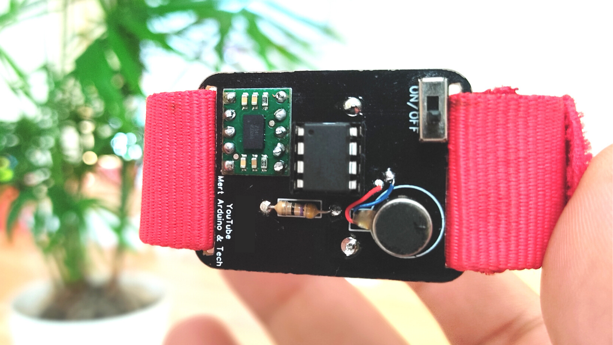
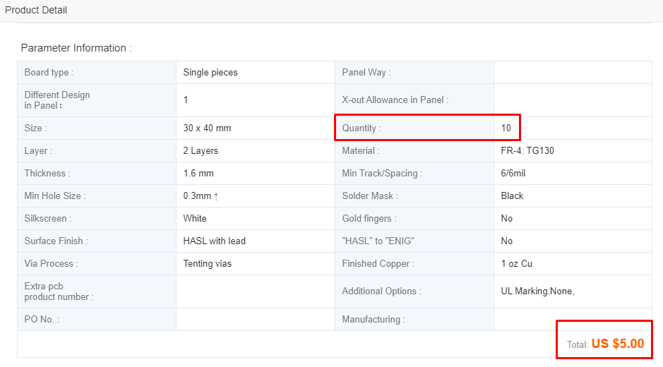
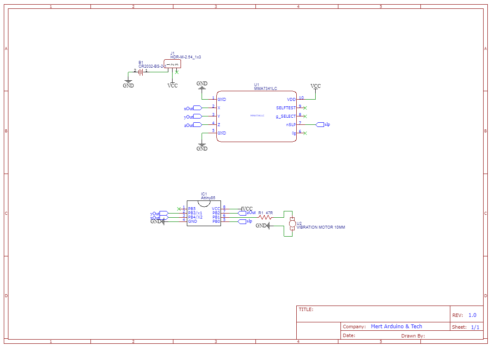
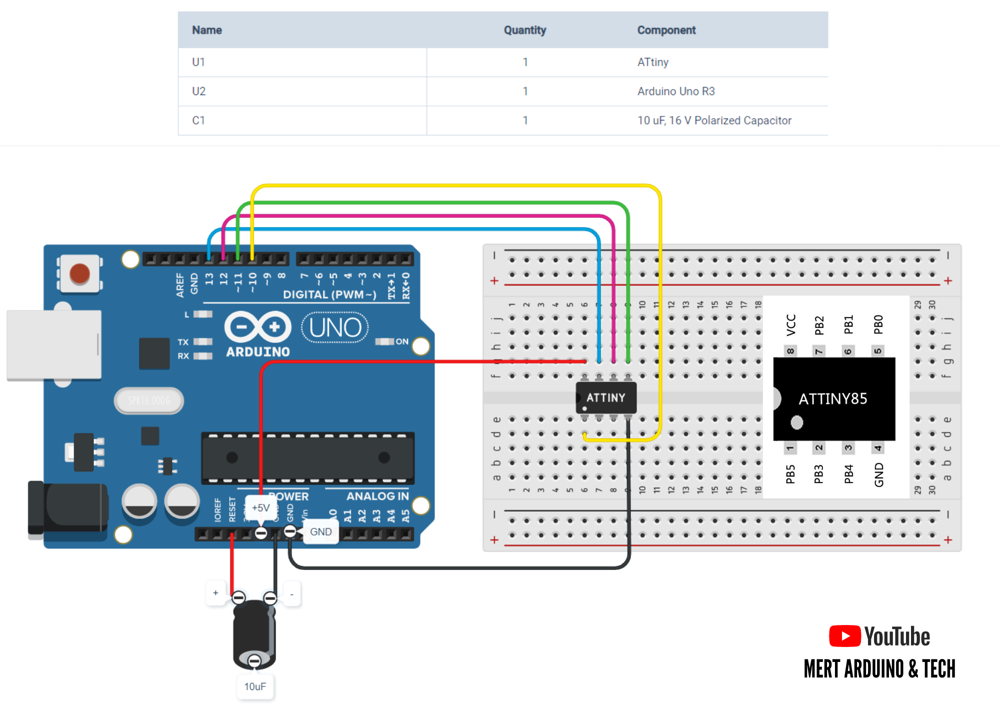
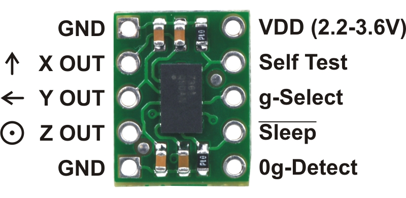

# ATtiny85 Wearable Activity Tracking Watch
This is a wearable gadget designed to vibrate when it detects stagnation. This is what inspired the Vibrating Watch, a simple activity tracker that will notify you when you are inactive for a pre-set period of time.   
In this project, we'll build a wearable gadget designed to vibrate when it detects stagnation. This device is low-cost and can help keep you on the move.  
    
# Get the Schematic and Gerber File (Also order):</b>  
https://www.pcbway.com/project/shareproject/ATtiny85_Wearable_Activity_Tracking_Watch.html   
    
# Video Tutorial
  
# About the Schematic
The heart of this project is the ATtiny85. This microcontoller can be programmed with the Arduino IDE and is easy to fit into projects to keep cost and size down. With three analog inputs and two PWM outputs, the ATtiny85 has just enough I/O for this project. For our activity sensing needs, I am using the MMA7341LC 3-axis accelerometer which outputs each axis on a different analog line. This accelerometer also has a sleep mode that can be activated by the microcontroller to improve battery life. Our activity reminder will come through a vibration motor which, despite its small size is powerful enough.
    
**ATtiny85 IC -** https://bit.ly/3g7yVXJ  
**Vibration Motor -** https://bit.ly/3f9h5C4  
**3-Axis Accelerometer -** https://bit.ly/309kbSB  
**Battery Holder -** https://bit.ly/2BBnmZC  
**8 Pin Socket -** https://bit.ly/339tQtY  
**Slide Switch -** https://bit.ly/30SPrnP  
**Resistor -** https://bit.ly/2WFsNPl  
**Strap -** https://bit.ly/3g8GhKj  
**CR2032 Battery -**
**Soldering Tools -** http://bit.ly/2Kbr9hQ   
# Programming an ATtiny85 with an Arduino UNO
**Configuring Arduino Uno as a ISP (In-System Programming):** 
To program the ATtiny85 we need to first set Arduino Uno in ISP mode. Connect your Arduino Uno to the PC. Open Arduino IDE and open the ArduinoISP example file (File - Examples - ArduinoISP) and upload it.  
**Adding ATtiny85 Support to Arduino IDE:** 
By default Arduino IDE doesn't support ATtiny85 so we should add ATtiny boards to Arduino IDE. Open File - Preferences and in the Additional Boards Manager URLs give this URL:  
https://raw.githubusercontent.com/damellis/attiny/ide-1.6.x-boards-manager/package_damellis_attiny_index.json   
Open Tools - Board - Board Manager. Scroll down the list where it says "ATtiny by Davis A. Mellis". Click on that and install it. Now you would be able to see a new entry in the Board menu  
**Connecting ATtiny85 with Arduino Uno:** 
Now with all the above things ready we will start programming the ATtiny85. Connect the ATtiny85 to Arduino Uno using breadboard. Add a 10uF capacitor between RESET and GND in the Arduino Uno. This is to avoid the Arduino Uno from being auto reset when we upload the program to the ATtiny85.  
    
# Burn Bootloader and Uploading Source Code to the ATtiny85
Now back to the Arduino IDE. Select ATtiny under Tools - Board. Then select ATtiny85 under Tools - Processor. Select 8 MHz (internal) under Tools - Clock.  
Then make sure Arduino as ISP is selected under Tools - Programmer  
By default the ATtiny85 runs at 1MHz. To make it to run at 8MHz select Tools - Burn Bootloader.  
You will get the above message if burning bootloader was successful.  
Now open the source code and upload it.  
# About the Program
The source code is to notify the wearer if a predefined timer has run out. The source code reads the accelerometer output signals, compares them to a threshold, and resets the timer if the threshold is exceeded.  
The program is asleep for the majority of the time but wakes up once every minute to monitor the accelerometer. While monitoring the accelerometer the program checks the acceleration values once a second for 5 seconds.  
The acceleration values are compared to a pre-set activity threshold. If they exceed this threshold the activity timer is reset. When the activity timer expires, the vibration motor is activated to prompt the user to be more active.  
    
**About the MMA7341LC 3-Axis Accelerometer:** 
https://www.pololu.com/product/1247  
